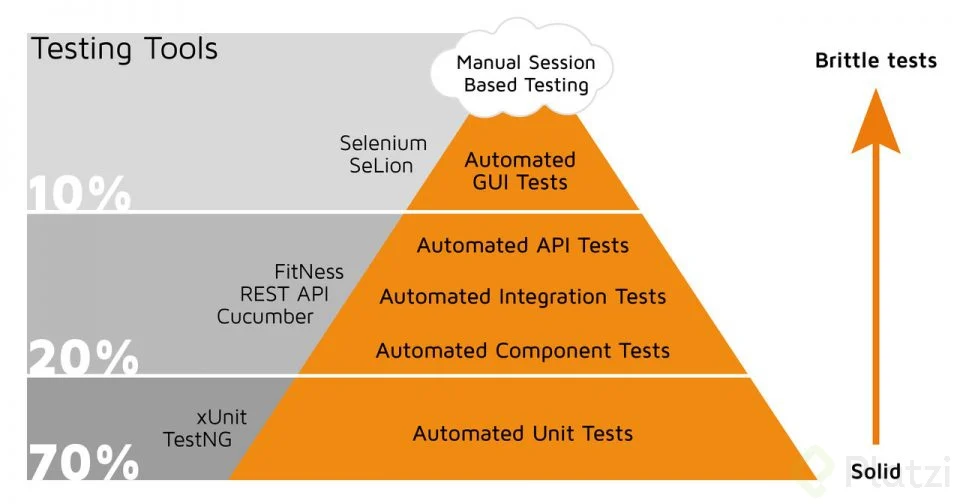
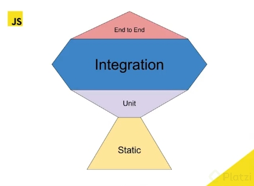

# Aprendiendo Testing en JavaScript

## ¿Qué es el testing?

En el mundo actual las tecnologías con las que vivimos necesitan código, esto ha hecho que el desarrollo de software se haya vuelto industrial, donde contamos con procesos y herramientas, como el testing, que nos permiten entregar mas rápido proyectos de calidad a nuestros clientes reduciendo el riesgo de errores en producción.

_Resolver un bug en desarrollo es mucho más barato que resolverlo en producción._

## ¿Por que hacer testing?

Normalmente hay cuatro fases en el desarrollo de software para crear un producto:

`Diseño ⇒ Desarrollo ⇒ Pruebas ⇒ Producción`

En estas fases, detectar un error se vuelve cada vez mas costoso. Ahi es donde hacemos técnicas para prevenir estas situaciones. El testing es la manera en la que nosotros gestionamos el riesgo y tratamos de evitar, en la medida de lo posible, los errores en el sistema.

## Gestionar riesgos como Google

1. **Análisis de código estático:** Mientras desarrollamos vamos viendo nuestros resultados gracias al uso de herramientas como: Eslint, Prettier, Spell Checker, y TypeScript.
2. **Pruebas unitarias:** Nos aseguramos que el código funciona como queremos.
3. **Pruebas de integración:** Verificar que varios elementos funcionan bien trabajando juntos.
4. **Revision de código:** Equipo o persona encargada de revisar el código de las demás personas.
5. **QA:** Equipos de creación de pruebas automáticas o manuales.

## Patrones de testing

### Pirámide del testing

Esta pirámide incluye todas las capas de testing que se pueden implementar dentro de un proyecto, comenzando en la base con las pruebas más repetidas) y terminando en la cima con las pruebas menos repetidas (y más costosas).

_Aclarar que existe un antipatrón, en el cual se invierte la figura formando un cono._

Por otro lado también tenemos el trofeo del testing que implementa de una forma diferente a la pirámide del testing, donde se implementan las pruebas estáticas del código (las cuales son las más repetidas y rápidas), luego las pruebas unitarias (las cuales son las más rápidas y menos repetidas) y por último las pruebas de integración (dando mayor importancia a estas) y finalmente las pruebas End to End o E2E (las cuales son las menos repetidas y más costosas).

### Trofeo del testing

## Herramientas de testing

En JavaScript existen una gran variedad de herramientas para hacer testing, pero a pesar de la gran variedad la mayoría de ellas siguen un patrón y sintaxis similar.

En la página de [State Of Js](https://stateofjs.com/en-us/) podemos encontrar información sobre las herramientas más populares en el mundo JavaScript para dicha tarea.

### Tools de testing de propósito general

Estas herramientas se pueden utilizar tanto en el lado del cliente como en el lado del servidor.

1. Jest
2. Chai
3. Mocha
4. Ava
5. Jasmine

### UI Testing

1. Playwright
2. Cypress
3. WebdriverIO
4. Puppeteer
5. Storybook

### API Testing

1. SuperTest
2. Dredd
3. Postman

### Static Testing

1. Eslint
2. Prettier
3. Spell Checker
4. TypeScript

## Fases de un proyecto

1. Requerimientos
2. Diseño y arquitectura
3. Desarrollo
4. QA
5. Producción

### Requerimientos

- **SUT:** Requerimientos
- **Ejecución:** Manuales
- **Objetivos:** Validar
- **Herramientas:** Inspección

### Diseño y arquitectura

- **SUT:** Sistemas
- **Ejecución:** Manuales / Automática
- **Objetivos:** Verificar
- **Herramientas:** Case Tools

### Desarrollo

- **SUT:** Depende
- **Ejecución:** Automática
- **Objetivos:** Verificar

Se pueden dividir en dos tipos: Funcionales y no funcionales.

#### Funcionales

- Pruebas estáticas
- Unit test
- Pruebas de integración
- End to End (E2E)

#### No funcionales

- Rendimiento
- Carga o estabilidad
- Prueba de estrés
- Usabilidad
- Seguridad
